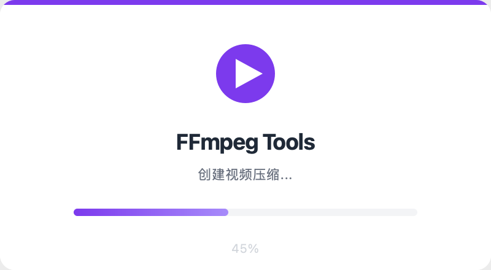
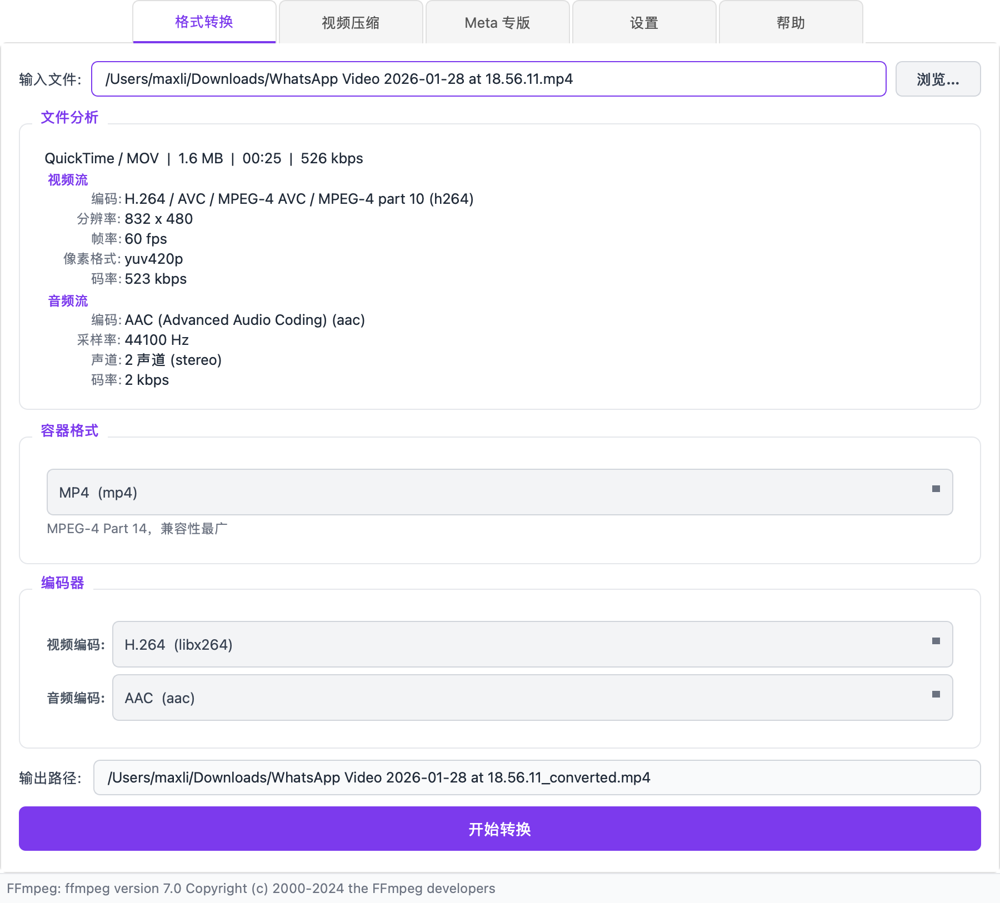
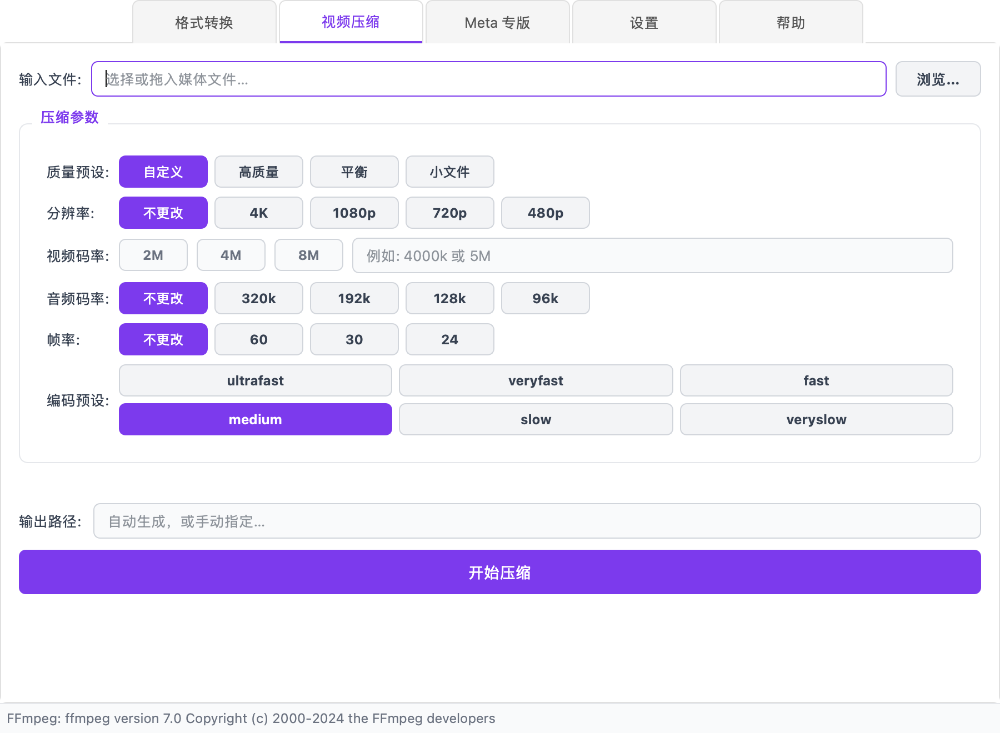
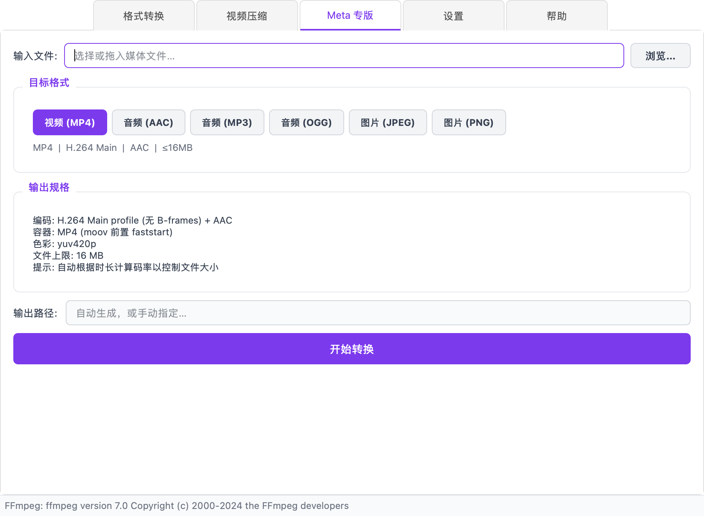
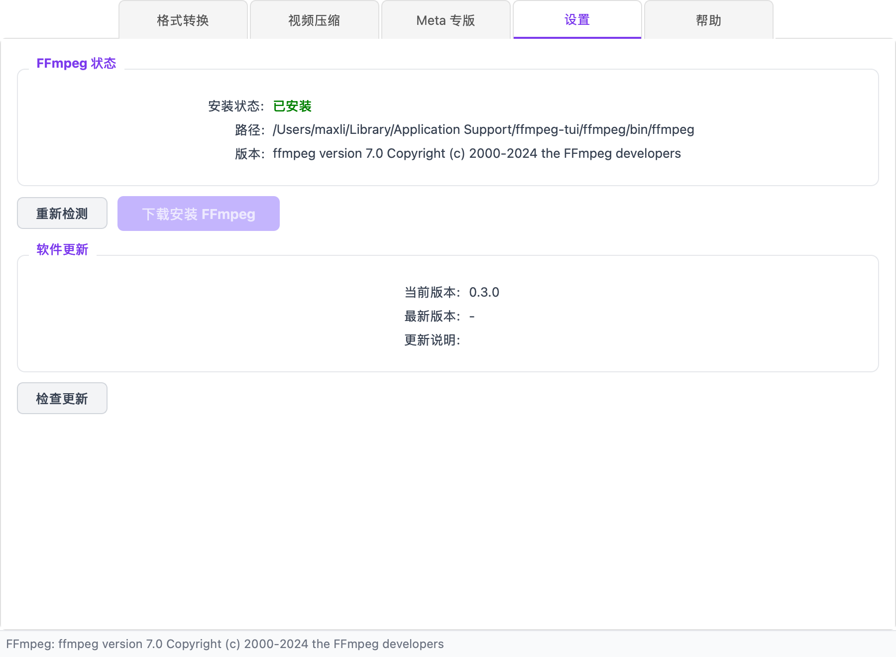

## 背景

FFmpeg 大概是多媒体处理领域最强大的命令行工具了，但它的问题也很明显——参数太多，记不住。

每次想把一个视频从 MKV 转成 MP4，或者压缩一下发给同事，我都要去翻文档。更别提给 WhatsApp 做媒体适配时，那一堆编码参数、码率限制、分辨率要求了。

所以我做了 **FFmpeg Tools**，一个极简的 FFmpeg 图形界面。目标很明确：**把 80% 的常用操作做到点几下就能完成**。

## 它长什么样

启动时有一个加载闪屏，显示初始化进度：



主界面分 5 个标签页，覆盖日常最常用的场景。

## 格式转换

这是最基础的功能。选文件、选格式、点转换。



亮点是选择文件后会自动调用 ffprobe 分析，展示完整的媒体信息——编码器、分辨率、帧率、码率、音频参数一目了然。这些信息对做转换决策很有帮助，比如你能看到源文件是 H.264 还是 H.265，就知道要不要重新编码。

支持的格式覆盖了日常所需：

- **容器**: MP4, MKV, WebM, AVI, MOV, FLV, TS, OGG 等
- **视频编码**: H.264, H.265, VP9, AV1, 或直接复制原始流
- **音频编码**: AAC, MP3, Opus, Vorbis, FLAC

## 视频压缩

压缩页面提供了一组直观的参数面板：



从「高质量」到「小文件」有快捷预设，也可以精细调节每个参数。设定视频码率后会实时估算输出大小，不用转完才发现文件还是太大。

实际使用中最常用的搭配是：**720p + 2M 码率 + medium 预设**，基本能把大部分视频压到合理体积。

## Meta 专版

这个功能是为 WhatsApp Business API 做的。WhatsApp 对媒体文件有严格限制：视频/音频不超过 16MB，图片不超过 5MB，还要求特定的编码参数。



选好目标格式后，工具会自动计算合适的码率来满足体积限制。比如一个 2 分钟的视频，它会反推出不超过 16MB 所需的最大码率，然后用这个值去编码。

支持 6 种输出格式：MP4 视频、AAC/MP3/OGG 音频、JPEG/PNG 图片。

## 一些实现细节

### 技术栈

- **GUI**: PyQt6
- **核心**: 调用系统 FFmpeg / FFprobe
- **打包**: PyInstaller，支持 macOS / Windows / Linux
- **CI/CD**: GitHub Actions 自动构建发布

### FFmpeg 内置管理

考虑到很多用户系统上没装 FFmpeg，工具内置了一键下载安装功能。检测到未安装时会提示去设置页处理，下载进度实时显示。



### 文件分析

用 `ffprobe -show_streams -show_format -print_format json` 获取完整的流信息，解析后展示在一个紧凑的面板里。只取第一个视频流和第一个音频流，覆盖绝大多数场景。

### 进度追踪

FFmpeg 的 `-progress pipe:1` 参数会输出结构化的进度信息，解析 `out_time` 和总时长就能算出百分比。再结合 `speed` 值可以估算剩余时间。

## 开源

项目完全开源，代码在 [GitHub](https://github.com/chenglun11/ffmpeg-tools)。

如果你也经常和 FFmpeg 打交道，欢迎试用和反馈。从 [Releases](https://github.com/chenglun11/ffmpeg-tools/releases) 可以直接下载打包好的版本，macOS / Windows / Linux 都有。

也可以从源码运行：

```bash
pip install -e ".[gui]"
python -m ffmpeg_tui.gui
```
